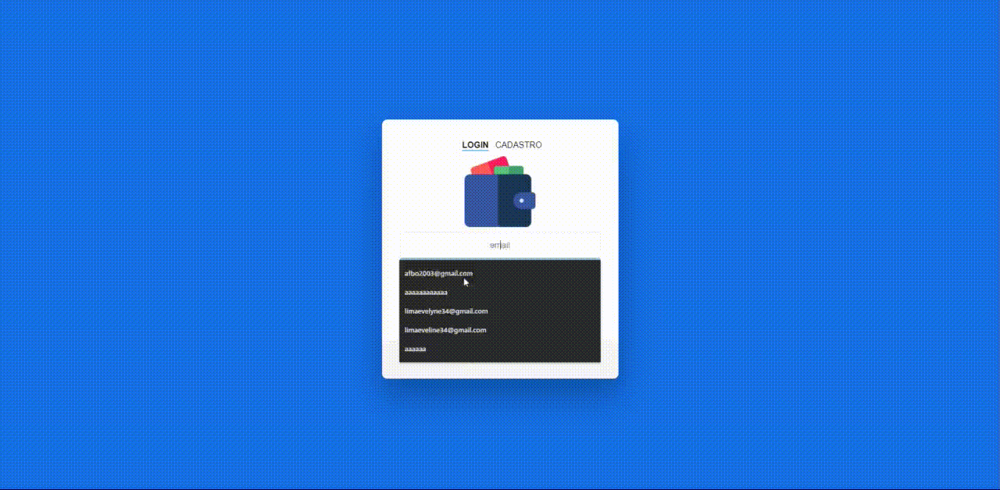

  

Aplicação de controle financeiro desenvolvida para cadeiras de Projeto e Desenvolvimento-01 e Web-01 no curso de Tecnologia em Sistemas para Internet do IFPE Campus Igarassu

# Tecnologias

O projeto foi desenvolvido utilizando PHP, PDO, html, css, javascript e Mysql

  

